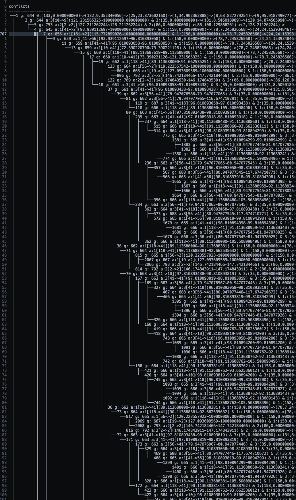
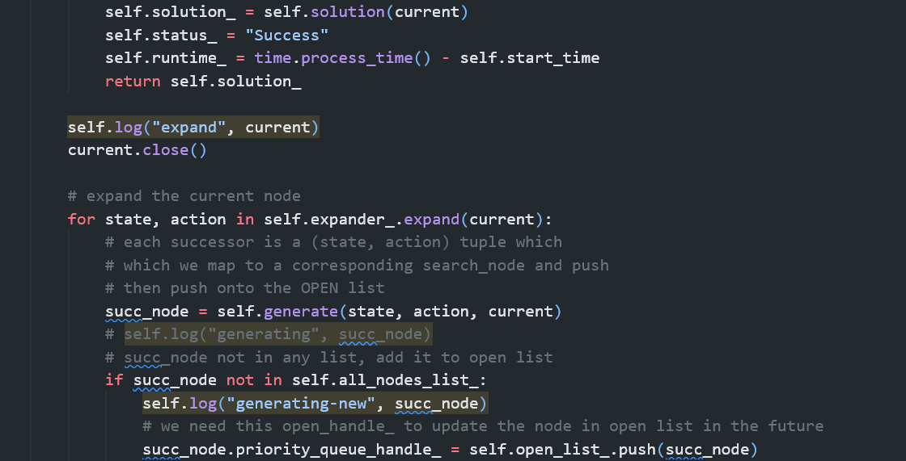
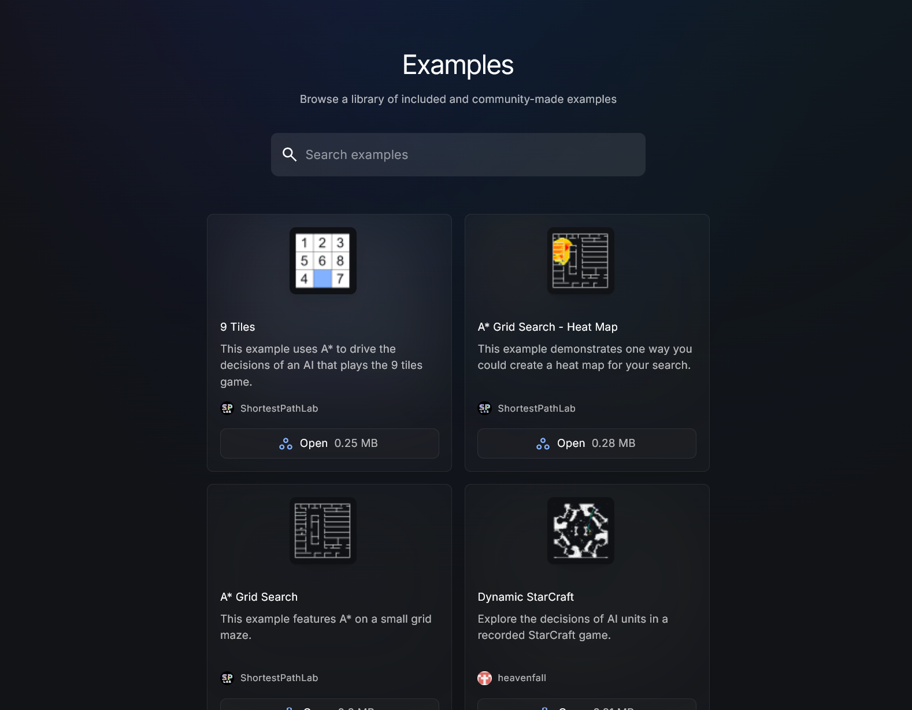

# **Celebrating visualisation in search and planning**

<!-- For those from overseas
- Hope you're enjoying Australia
For those from Australia but not from Melbourne
- Hope you're enjoying Melbourne
For those who are from Melbourne
- Hope you're um enjoying here -->

---

Find the slides here

https://pathfinding.ai/posthoc-icaps25/

---

1. Set the scene (5 minutes)
2. The Posthoc project (5 minutes)
3. Live demos (5 minutes)
4. The future of visualisation (5 minutes)

---

---

---

---

# 
"Spontaneous brilliance"

---

# 1. Visualisation for search

---

InLPG [Link](https://lpg.unibs.it/lpg/pubblications/ICAPS08.pdf)

(Gereveni and Saetti, 2008)

---

Web Planner [Link](https://www.meneguzzi.eu/felipe/pubs/uisp-web-planner-2017.pdf)

(Magnaguagno et al., 2017)

---

MovingAI Lab Demos [Link](https://movingai.com/)

(Sturtevant, 2020)

---

MAES [Link](https://icaps22.icaps-conference.org/demos/ICAPS_2022_paper_384.pdf)

(Andreason et al., 2022)

---

# How about using visualisations for _my_ problem?

Search problems come in all shapes and sizes.

- Various domains
- Various algorithms and procedures
- Different programming languages
- We want to see different things

 

PlanViz [Link](https://github.com/MAPF-Competition/PlanViz)
(Chan et al., 2024)

---

# Existing problem solving methods we see

- Use one of the visualisers
- Logs
- Debuggers
- DIY from scratch
- Trial and error
- Matplotlib hacks
- Just think **harder**

---

# So how do we incorporate visualisation into everyday problem solving?

- Framework that makes a minimal set of powerful assumptions
- Way to record program behaviour
- Way to quickly DIY visualisations

Also

- Language agnostic

---

# 2. The Posthoc project

---

# Setting expectations

- Simple but effective visualisations
- Not trying to replace any tools

---

# Two parts

- Search trace
- Posthoc visualiser

---

# Search trace

- Textual recording of your algorithmic procedure
- Optional description of the visualisation model

Why YAML?

- Standing on shoulder of giant
- Super easy to read and write (for people _and_ programs)

---

# Producing search traces

- Just `print()` / `cout << ` / `System.out.println()`
- Solvers can generate them e.g. `--log`
- Write small examples by hand

---

# Posthoc visualiser

- Separate from the search trace
- Replay and interactive inspection
- Toolbox/visualisation suite for search traces
- Tree and graph visualisations
- Custom visualisations
- Breakpoints for debugging

---

# Live demo

- Creating search traces
- Posthoc quickstart
- Tree and graph visualisations
- How custom visualisations work
- Playback and inspection

 

Follow along:
https://pathfinding.ai/news/using-posthoc-with-piglet/

---

# What's next

---

# Towards interoperable visualisations

### @solver developers

- Requires solver support
- Let your algorithmic procedures be visualisable via search traces
- Generate logs in the search trace format

### @tools developers

- Tools that take in the search trace for analysis

---

# Making progress in search and planning discoverable

- A place to store, share, and publish visualisations
- Let the community discover your work

---

# The future for the Posthoc visualiser

- Extension marketplace
- Component libraries (higher-order components)
- Renderers (3D, point cloud, splatting)
- Direct solver/visualiser interactivity (automatically pull in search traces)
- Many in-development and planned features
- 34 open issues
- Star us on GitHub: https://github.com/shortestpathlab/posthoc-app

---

---
