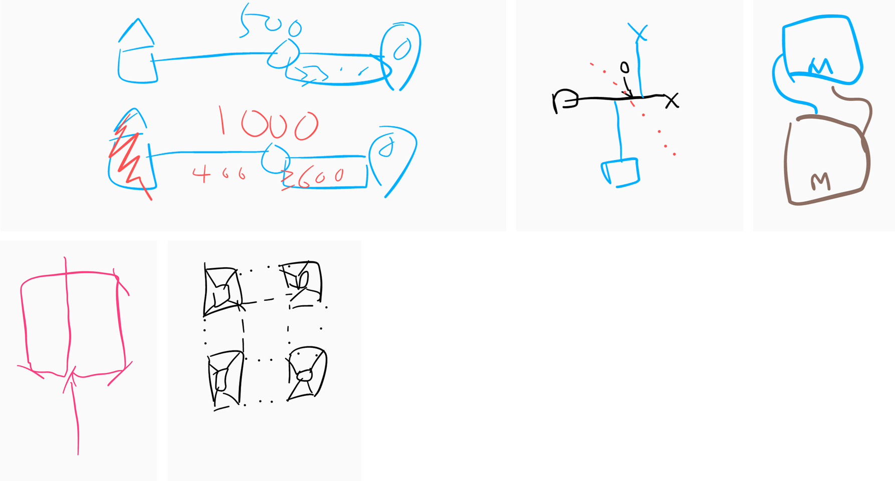
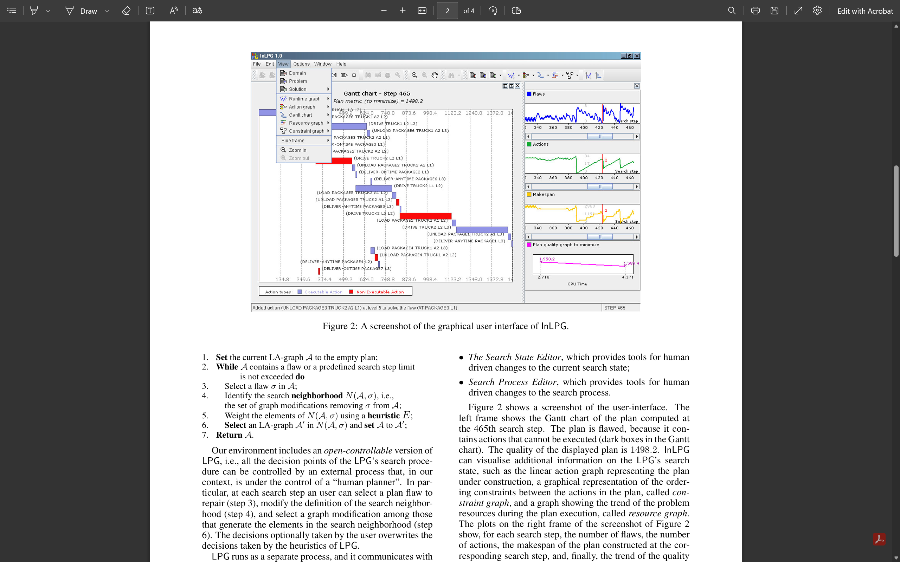
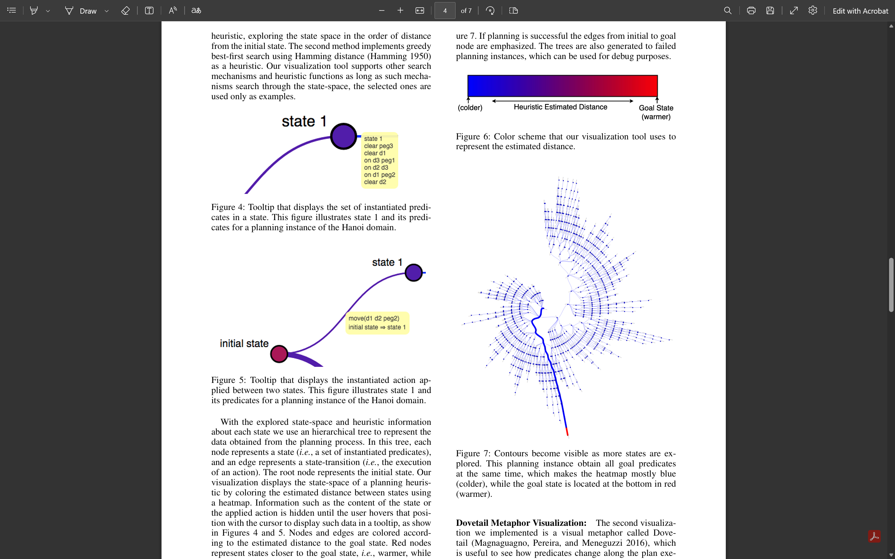
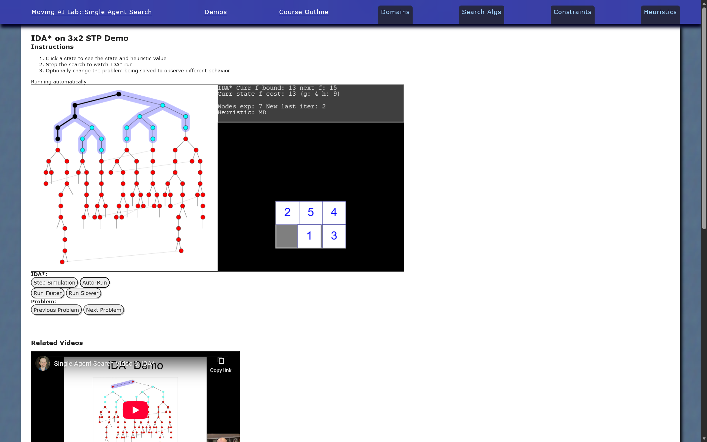
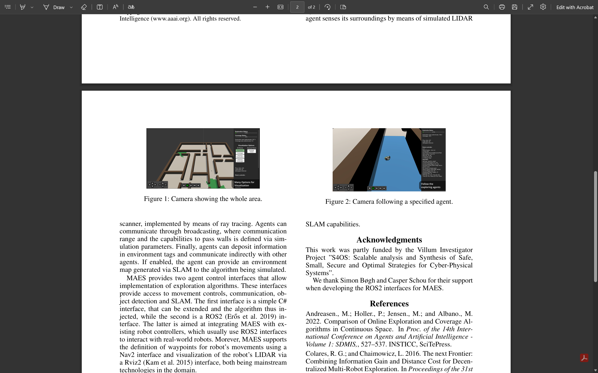
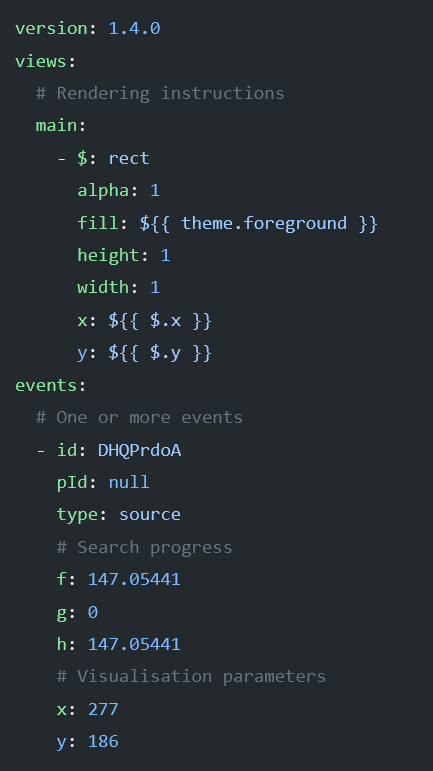

# **Celebrating visualisation in search and planning**

<!-- For those from overseas
- Hope you're enjoying Australia
For those from Australia but not from Melbourne
- Hope you're enjoying Melbourne
For those who are from Melbourne
- Hope you're um enjoying here -->

---

1. Set the scene (5 minutes)
2. Posthoc (5 minutes)
3. Live demos (5 minutes)
4. The future of visualisation (5 minutes)

---

---

---

---

# 
"Spontaneous brilliance"

---

Visualisation for search

---

InLPG

(Gereveni and Saetti, 2008)

---

Web Planner

(Magnaguagno et al., 2017)

---

MovingAi Lab Demos

(Sturtevant, 2020)

---

MAES

(Andreason et al., 2022)

---

# Problem solving techniques

- Use one of the visualisers
- Logs
- Debuggers
- Trial and error
- Think **harder**

---

# Search problems come in all shapes and sizes

- Various domains
- Various algorithms and procedures
- Different programming languages
- We want to see different things

 

PlanViz
(Chan et al., 2024)

---

# So how do we incorporate visualisation into everyday problem solving?

- Framework that makes a minimal set of powerful assumptions
- Language agnostic
- We let you DIY the visualisation

---

# Setting expectations

- Simple but effective visualisations
- Not a replacement visualiser

---

# Two parts

- Search trace
- Posthoc visualiser

---

# Search trace

- Textual recording of your algorithmic procedure
- An optional description of the visualisation model
- Why YAML? It's easy to read and write

---

# Towards interoperable visualisations

- A place to share and collaborate on visualisations
- ***

# Dear solver developers

- Visualise your algorithmic procedure

---

# Dear developers

- Develop tools for search trace analysis
